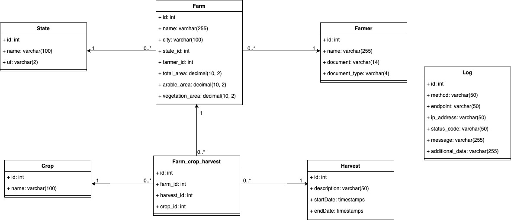

# Brain Agriculture

Projeto para gestão de propriedades rurais, focado em análise de dados agrícolas.

## Sumário
- [Como subir o projeto (Docker)](#como-subir-o-projeto-docker)
- [APIs Disponíveis](#apis-disponiveis)
- [Como rodar os testes](#como-rodar-os-testes)
- [UML do Projeto](#uml-do-projeto)
- [Informações adicionais](#informacoes-adicionais)

## Como subir o projeto (Docker)

1. Certifique-se de ter o Docker e o Docker Compose instalados.
2. Clone o repositório e acesse a pasta do projeto.
3. Crie um arquivo `.env` com as variáveis necessárias (exemplo disponível em `.env.example`).
4. Execute o comando:

```bash
docker-compose up --build
```

A aplicação estará disponível em `http://localhost:3333`.

## APIs Disponíveis

- `GET /dashboard/stats` — Estatísticas do dashboard

- `GET /api/farmer` — Listar produtores
- `GET /api/farmer/:id` — Exibir produtor por id
- `POST /api/farmer` — Criar produtor
- `PUT /api/farmer/:id` — Editar produtor
- `DELETE /api/farmer/:id` — Deletar produtor

- `GET /api/crop` — Listar culturas
- `GET /api/harvest` — Listar colheita

As APIs estão documentadas no arquivo `assests/serasa-test.postman_collection.json`.
Para acessar a documentação, basta importar o arquivo no Postman.
Uma observação: 
  - Para a criação ou edição de um produtor, é necessário enviar o id da crop e harvest. Logo, esses dados estão disponiveis nas rotas GET /api/crop e GET /api/harvest.

## Como rodar os testes
Para rodar os testes, execute o seguinte comando:

```bash
npm install
npm run test
```

Os testes estão localizados na pasta `tests/`.

Unit tests:


Integration tests:


Obs: para a execução dos testes será criado um banco de dados de teste, o sqlite.

## UML do Projeto


UML do Projeto baseado nessas regras:
- Permitir o registro de várias culturas plantadas por fazenda do produtor.
- Um produtor pode estar associado a 0, 1 ou mais propriedades rurais.
- Uma propriedade rural pode ter 0, 1 ou mais culturas plantadas por safra.
- Exibir um dashboard com:
  - Total de fazendas cadastradas (quantidade).
  - Total de hectares registrados (área total).
  - Gráficos de pizza:
  - Por estado.
  - Por cultura plantada.
  - Por uso do solo (área agricultável e vegetação).

## Informações adicionais

- O banco de dados utilizado é o PostgreSQL (ver configuração no `docker-compose.yml`).
- As variáveis de ambiente estão documentadas no arquivo `.env.example`.
- Para rodar migrações manualmente:

```bash
docker-compose exec app node ace migration:run
```

---
